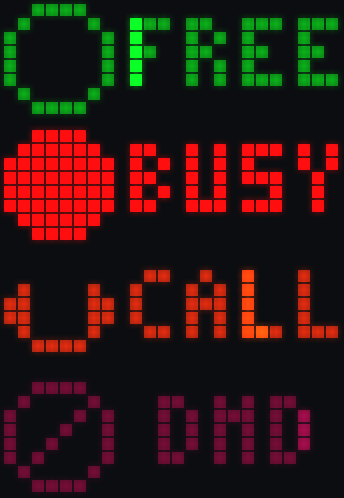
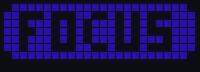
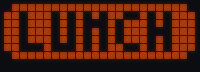
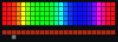
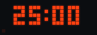
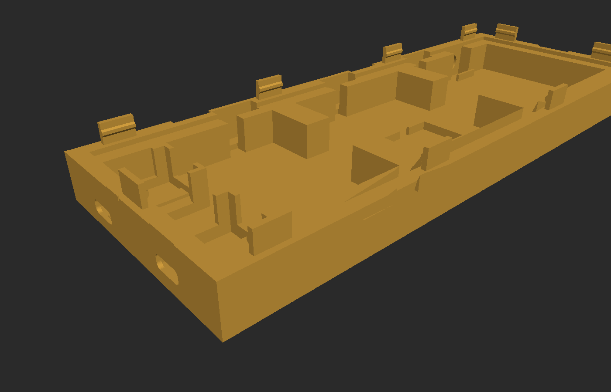
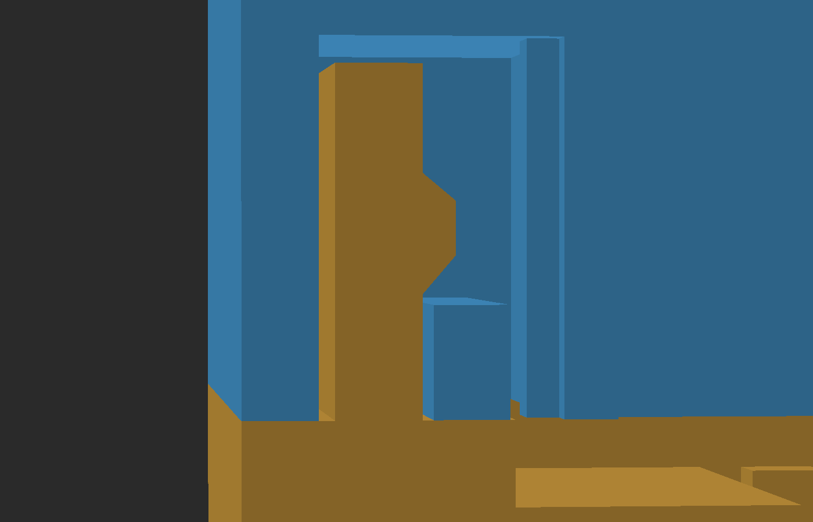
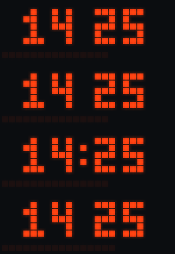
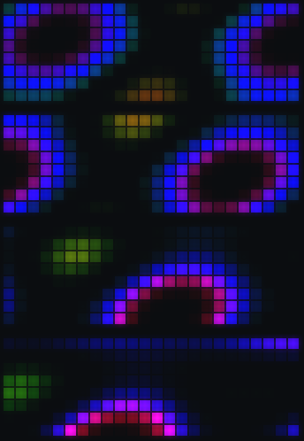

# Pixelbar

An 8×24 WS2812B desk panel driven by an ESP32-C3, built as an open alternative
to a Busy Bar: it shows your status to the room, runs a focus timer, and takes
input from three hidden touch zones and a rotary encoder.

The panel is three 65 mm 8×8 WS2812B boards butted edge to edge inside a
snap-fit printed case, behind a per-LED light grid and a diffuser.



## Status

**The display layer, the input model and the screen tree are done.** Icons, a
mini font, transitions, flourishes and continuous motion at 100 fps; a gesture
recogniser, a navigable menu and settings that persist. All of it unit tested
on the host, drivable from a terminal, with the ESP32-C3 image building.

The panel itself is wired and working — the LED mapping below was confirmed
against it. None of *this* firmware has driven it yet, and the touch pads,
encoder and accelerometer are not connected.

Still to come, in order: the device input layer, moving the LED output from RMT
to SPI+GDMA before any of the network work (see below), WiFi with a web page
and OTA, then the Mac helper that flips the panel to BUSY when your microphone
opens, and Slack and calendar after that.

## Controls and screens

Three touch zones sit under the top edge, marked by printed dimples, and the
encoder knob is on the top edge at the right.

| Input | Action |
| --- | --- |
| Left zone, tap | FREE ↔ BUSY |
| Left zone, double-tap | CALL |
| Left zone, hold | CALL |
| Middle zone, tap | Start or pause the focus timer |
| Middle zone, hold | Reset the timer to its set length |
| Right zone, tap | Next view: status → clock → timer |
| Right zone, hold | DND on or off |
| Left and right together | Sleep or wake |
| Swipe across the zones | Next or previous view |
| Knob, turn | The value on this screen, or the view at rest |
| Knob, press | Confirm, or step to the next adjuster |
| Knob, double-press | Back to the home view |
| Knob, hold | Open the menu |
| Knob, press and turn | Brightness, from anywhere |
| Double-tap the case | FREE ↔ BUSY |
| Shake | Back out |
| Lay the panel flat | Sleep |

A tap never waits to find out whether it is going to become a double tap:
holding it back for the 280 ms that would take puts the delay on the most-used
gesture on the device. The first tap fires at once and the second *supersedes*
it, which works because the actions behind them are assignments — BUSY, then
CALL — rather than steps.

Telling a chord from a swipe is the awkward one, because a finger dragged
across the pads lights two at once as well. Timing cannot separate them: for the
first hundred milliseconds a brisk swipe and a two-finger press are identical.
What separates them is that a chord is *held* and a drag is not.

The status words are each 23 px wide in the proportional font, so they sit
still and centred rather than scrolling. Anything wider than the panel scrolls
automatically.

An 8x8 icon, a one pixel gutter, and the label in a 3x5 mini font: exactly 24
columns, so a status word never scrolls. FREE is an open ring and BUSY is the
same ring filled in, which is what makes the change between them read as the
ring solidifying.

That layout has 15 columns for the word, and AWAY, FOCUS, LUNCH and MEET are
wider than that. Rather than scroll them, those statuses drop the icon and take
the whole panel as a **badge**: a filled field in the status colour with the
word cut out of it in black. Colour carries the meaning, so no picture is
needed, and it reads from much further away because the lit area is three times
larger. The two layouts turn over into each other without either knowing which
the other is.

The badge fill is held below full value on purpose. A full-width field lights
about 150 LEDs where the icon layout lights 48, and at full value the brighter
statuses draw past the 2500 mA cap — which the renderer would handle by scaling
*those statuses only*, so changing status would visibly change how bright the
panel is.

| | |
| --- | --- |
|  |  |
|  |  |
|  |  |
|  |  |

Holding the knob opens a menu, which scrolls like the view cycle does. The
status picker shows each status *as the panel would show it* rather than as a
row about it, so what you are scrolling through is a preview of what the room
will see.

Elements change in place rather than moving across the panel. A digit turns
over like the face of a counter wheel — both faces on screen for the whole
turn, the outgoing one foreshortening and riding away from the axis while the
incoming one rises into it, which is the projection of a cylinder and is drawn
as one. An icon and its label hand over by collapsing into themselves while the
next pair grows out of the same spot.

Everything moves. Icons breathe, CALL animates its handset and pulses harder
because it is the one status that must interrupt you, the clock's second hand
walks the panel's 60-pixel perimeter, timer digits roll, bars glide to their
targets, and the colour picker has a specular band travelling its ramp.

## Transitions

The motion is semantic: it tells you what kind of move just happened.

| | |
| --- | --- |
|  |  |

| Gesture | Motion |
| --- | --- |
| Moving through the view cycle | The panel turns like a record |
| Opening an adjust screen | Wipes up, like a drawer |
| A status change | The new colour bursts out of the icon and is drawn back into it |
| Sleeping or waking | Fades through black |

The timer finishing is the moment the device exists for, so it takes the whole
panel: one frame of white, a quarter-second settle into the status colour with
the tick drawing itself on, about a second held with a highlight crossing, then
a fade that *uncovers* what was underneath rather than painting over it. Any
input gets you out of it — a celebration you have to sit through is an
obstacle.



Nothing slides. The panel is read as a radial strip of a disk — column 0 at the
hub, column 23 at the rim — so content printed on it advances through the same
*angle* at every radius and therefore a different *distance*. The rim end whips
past while the hub end crawls, and a glyph shears as it goes because its left
edge is moving slower than its right. A slide moves every column by the same
amount, which at 24 columns reads as pixels being moved rather than an object
turning.

A status change is not a transition at all but an event: a front of the new
colour bursts out of the icon with a white-hot leading edge, floods the panel,
and is then drawn back in — and what it uncovers is the new screen. It lands on
the icon, because that is where it came from.

Both screens keep animating for the whole move, and the outgoing one is drawn
with the state it had when the move began, so a status change animates from the
old word into the new one rather than flipping instantly.

## What makes it smooth

More animation on its own would have looked stepped, because the pipeline
quantised motion in six separate places. Fixing those was most of the work.

| Was | Now |
| --- | --- |
| 62.5 fps, from `pdMS_TO_TICKS(1000/60)` truncating to 16 | 100 fps, which divides the 1 kHz tick exactly |
| `dt` rounded to 1 ms | microseconds, so a 10 ms frame is not quantised by 10% |
| Text jumped a whole LED every 83 ms | sub-pixel, the boundary LED lights partially |
| Bars snapped to 24 positions | anti-aliased, continuous at any fraction |
| Gamma table stopped at 236 | reaches 255, recovering the top 7.5% of range |
| ~44 brightness levels, so a 4 s fade held each for 9 frames | temporal dithering carries the remainder between frames |
| Output blocked the loop for 5.8 ms | queued, so the next frame draws while it clocks out |

The ESP32-C3 has no FPU, so `sinf` is emulated in software and plasma alone
wanted 576 of them per frame. Trigonometry is a 256-entry table.

## Hardware

| Part | Notes |
| --- | --- |
| 3 × 8×8 WS2812B matrix | 65 mm boards, 8 mm pitch, chained left to right |
| ESP32-C3 SuperMini | USB Serial/JTAG, so GPIO20/21 are free |
| 7Semi USB-C breakout | 5 V in, separate from the ESP32's own port |
| 3 × TTP223 (HW-763) | touch zones, sensing through 1.5 mm of the case wall |
| MPU-6050 (GY-521) | tap and orientation |
| EC11 encoder | bare, behind the top wall, knob on the top edge |
| 1N5819, 330 Ω, 1000 µF | back-feed block, data series resistor, bulk cap |

The GPIO map, the power wiring and the physical placement are in
[`hardware/WIRING.md`](hardware/WIRING.md), alongside the parametric enclosure
model and its interference audit.

```
hardware/WIRING.md                             # pin map, power, placement
hardware/enclosure/ws2812b_8x24_enclosure.py   # the model; edit params, re-run
hardware/enclosure/check.py                    # 16 interference + clearance checks
hardware/enclosure/fit_test.py                 # corner coupons for a test print
hardware/enclosure/render.py                   # the mesh renderer behind hardware/img
hardware/stl/                                  # tray.stl, grid.stl and the coupons
```

| | |
| --- | --- |
|  |  |

The snap closure is rigid posts on the tray meeting spring beams inside the
frame. The beams flex **in the print plane**, so nothing relies on the strength
of a layer bond — printing the parts flat would otherwise snap the hooks off the
first time you closed the case.

## Firmware quick start

Needs ESP-IDF v5.3 or newer. Nothing else: there are no managed components to
download, so it builds offline.

```bash
. $HOME/esp/esp-idf/export.sh
cd firmware
idf.py set-target esp32c3
idf.py build
idf.py -p /dev/cu.usbmodem* flash monitor
```

## The LED mapping

How the LEDs are wired *inside* one 8×8 board varies between suppliers, so it
is a config value rather than an assumption. For this panel it is settled,
taken from a WLED setup running on the same hardware:

| WLED | `kWiring` |
| --- | --- |
| 1st LED: Top / Left | `Corner::TopLeft` |
| Orientation: Horizontal | `Axis::Row` |
| Serpentine: unchecked | `serpentine = false` |
| Panel offsets X = 0, 8, 16 | `chainRightToLeft = false` |

The boards are **progressive, not serpentine**: every row runs left to right
and the chain drops back to the left at the end of each one. The original guess
here was serpentine, which is true of many 65 mm boards and not of these.

For a different panel, `Pattern::MapTest` is still there — set `kMapTestSeconds`
in `firmware/main/main.cpp` and watch:

- a **red** pixel marks logical (0,0), the top-left corner
- a **white** pixel walks the panel in logical order
- **green** pixels on the bottom row mark the seams between boards

The white pixel should sweep left to right along the top row, then drop to the
next. All sixteen combinations are covered by the tests, so any setting you pick
is guaranteed to address all 192 LEDs exactly once.

## Tests and preview, no hardware needed

The whole drawing layer is free of ESP-IDF, so it builds and runs on a laptop.

```bash
./test/run.sh                                    # builds and runs the tests
./test/sim.sh                                    # drive the panel from your keyboard
./build-host/preview docs/preview docs/screens   # still sheets
python3 tools/ppm2png.py docs/preview
python3 tools/ppm2png.py docs/screens

./build-host/preview --anim docs/anim            # animated clips
python3 tools/ppm2gif.py docs/anim               # needs Pillow
```

A still image cannot show whether motion is smooth, so the animation is
verified by watching the GIFs rather than by reading a description of them.

`./test/sim.sh` goes further: it runs the real state machine, the real gesture
recogniser and the real renderer at 100 fps in your terminal, and lets you drive
them from the keyboard — `a s d` tap the pads, `A S D` hold them, `e` swipes,
`, .` turn the knob, space presses it, `f` lays the panel flat. Keys become raw
pad levels and encoder counts rather than events, so the recogniser is exercised
for real: a tap is a pad going down and coming back up over several frames, and
a swipe is a drag with the overlaps a finger actually makes.

It draws out of the same GRB wire bytes that would go down the data line,
through the same LED mapping and gamma table, so a mapping or gamma mistake
shows up there rather than on a soldered panel. `./build-host/sim --selftest`
runs a scripted sequence with no terminal, for when you want it in a pipe.

The preview reads back the same GRB bytes that would go out on the wire,
through the same mapping, so a gamma or mapping mistake shows up on screen
instead of on a soldered panel.

| | |
| --- | --- |
|  |  |

The ambient patterns are still there as a screensaver.

## Power

192 LEDs at full white would draw about 11 A, which no USB-C supply will give
you. `Framebuffer::render` estimates the draw of every frame and scales it to
stay under a budget the caller passes in. The cap is enforced in the render
path, not in the patterns, so nothing drawn can exceed it.

The budget is a setting rather than a constant, because the panel has to be
right on both the supply it is developed on and the one it ships against:
2500 mA through the USB-C breakout from a 3 A source, and 1900 mA from the 2 A
brick on the bench. Nothing in the drawing layer is tuned to one number — the
heavy frames, a full-width status badge and the completion flash, are held
under 2300 mA so that at the design target they never trip the cap at all,
which is what keeps brightness consistent when you switch between screens. On
the smaller supply the cap does engage, but not until about 85% brightness.

The per-LED figure is 60 mA, the datasheet's three channels at 20. WLED uses a
measured 55 for the same part, so this runs about 9% pessimistic — the right
direction to be wrong in for a current estimate.

## Layout

```
firmware/components/panel/   framebuffer, mapping, fonts, icons, patterns,
                             screens, transitions, animation (no IDF deps)
firmware/components/ws2812/  WS2812B over RMT, no external components
firmware/main/               app_main, GPIO map
test/                        host-side tests
tools/                       PNG preview renderer
hardware/                    enclosure model, STLs, wiring
```

## License

MIT, see `LICENSE`.
